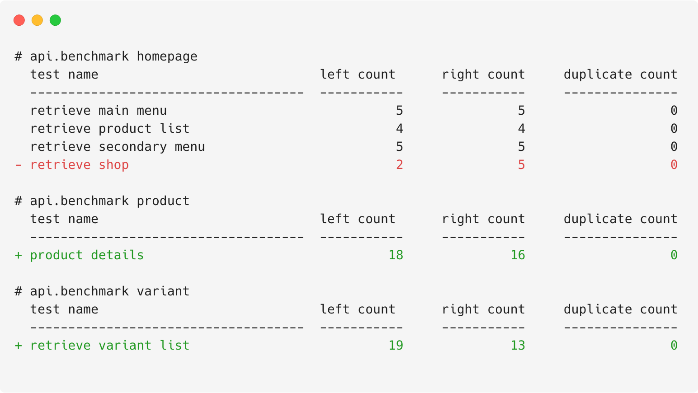

<div align='center'>
  <h1>pytest-django-queries</h1>
  <p>Generate performance rapports from your django database performance tests
  (inspired by <a href='https://coverage.readthedocs.io/en/v4.5.x/'>coverage.py</a>).</p>
  <p>
    <a href='https://travis-ci.org/NyanKiyoshi/pytest-django-queries/'>
      
    </a>
    <a href='https://codecov.io/gh/NyanKiyoshi/pytest-django-queries'>
      
    </a>
    <a href='https://pytest-django-queries.readthedocs.io/en/latest/?badge=latest'>
      
    </a>
    <a href='https://pypi.python.org/pypi/pytest-django-queries'>
      
    </a>
    <a href="https://pypi.org/project/pytest-django-queries/1.1.0/">
      
    </a>
  </p>
  <p>
    <a href='https://github.com/NyanKiyoshi/pytest-django-queries/compare/v1.1.0...master'>
      
    </a>
    <a href='https://pypi.python.org/pypi/pytest-django-queries'>
      
    </a>
    <a href='https://pypi.python.org/pypi/pytest-django-queries'>
      
    </a>
  </p>
</div>

## Usage
Install `pytest-django-queries`, write your pytest tests and mark any
test that should be counted or use the `count_queries` fixture.

Note: to use the latest development build, use `pip install --pre pytest-django-queries`

```python
import pytest


@pytest.mark.count_queries
def test_query_performances():
    Model.objects.all()


# Or...
def test_another_query_performances(count_queries):
    Model.objects.all()
```

Each test file and/or package is considered as a category. Each test inside a "category"
compose its data, see [Visualising Results](#visualising-results) for more details.

You will find the [full documentation here](https://pytest-django-queries.readthedocs.io/).

<!-- TODO: insert a graphic here to explain how it works -->

## Recommendation when Using Fixtures
You might end up in the case where you want to add fixtures that are generating queries
that you don't want to be counted in the results–or simply, you want to use the
`pytest-django` plugin alongside of `pytest-django-queries`, which will generate
unwanted queries in your results.

For that, you will want to put the `count_queries` fixture as the last fixture to execute.

But at the same time, you might want to use the the power of pytest markers, to separate
the queries counting tests from other tests. In that case, you might want to do something
like this to tell the marker to not automatically inject the `count_queries` fixture into
your test:

```python
import pytest


@pytest.mark.count_queries(autouse=False)
def test_retrieve_main_menu(fixture_making_queries, count_queries):
    pass
```

Notice the usage of the keyword argument `autouse=False` and the `count_queries` fixture
being placed last.

## Using pytest-django alongside of pytest-django-queries
We recommend you to do the following when using `pytest-django`:

```python
import pytest


@pytest.mark.django_db
@pytest.mark.count_queries(autouse=False)
def test_retrieve_main_menu(any_fixture, other_fixture, count_queries):
    pass
```


## Integrating with GitHub

TBA.

## Testing Locally
Simply install `pytest-django-queries` through pip and run your
tests using `pytest`. A report should have been generated in your
current working directory in a file called with `.pytest-queries`.

Note: to override the save path, pass the `--django-db-bench PATH` option to pytest.

## Visualising Results
You can generate a table from the tests results by using the `show` command:
```shell
django-queries show
```

You will get something like this to represent the results:
```shell
+---------+--------------------------------------+
| Module  |          Tests                       |
+---------+--------------------------------------+
| module1 | +-----------+---------+------------+ |
|         | | Test Name | Queries | Duplicated | |
|         | +-----------+---------+------------+ |
|         | |   test1   |    0    |     0      | |
|         | +-----------+---------+------------+ |
|         | |   test2   |    1    |     0      | |
|         | +-----------+---------+------------+ |
+---------+--------------------------------------+
| module2 | +-----------+---------+------------+ |
|         | | Test Name | Queries | Duplicated | |
|         | +-----------+---------+------------+ |
|         | |   test1   |   123   |     0      | |
|         | +-----------+---------+------------+ |
+---------+--------------------------------------+
```

## Exporting the Results (HTML)
For a nicer presentation, use the `html` command, to export the results as HTML.
```shell
django-queries html
```

It will generate something [like this](https://pytest-django-queries.readthedocs.io/en/latest/html_export_results.html).

## Comparing Results

You can run `django-queries backup` (can take a path, optionally) after
running your tests then rerun them. After that, you can run `django-queries diff`
to generate results looking like this:

<a href='./docs/_static/diff_results.png'>
  
</a>

## Development
First of all, clone the project locally. Then, install it using the below command.

```shell
./setup.py develop
```

After that, you need to install the development requirements. For that,
run the below command.

```shell
pip install -e .[dev]
```
